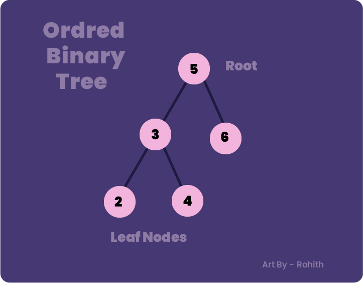
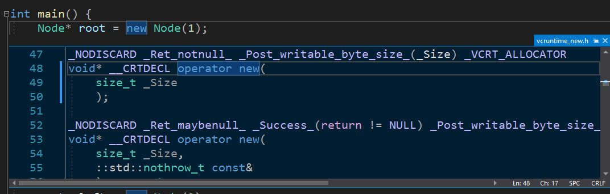
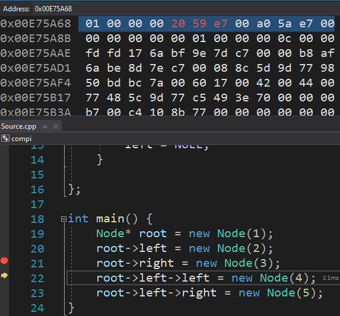
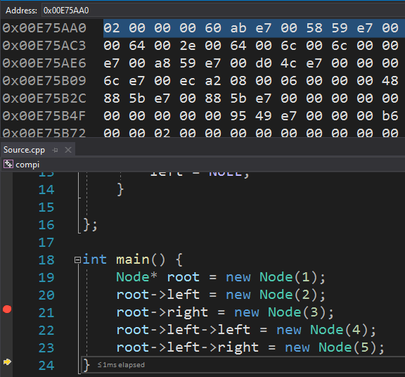

This post goes deep on the working of the binary tree.
The main reason why I made this post is that I struggled
with learning binary trees as it can be quite intimidating at first but is not that hard when we understand how the program works in a deeper level.

### Quick Brush Ups

> Binary tree is non-linear tree data structure in which each node has not more
> than two children.

> The top-most node is called Root node and the node which doesn't have any
> children is called a leaf node.

> Orderd binary tree is a binary tree where the Root's right and the Root's left should contain value greater than and less than as that of the Root node.

> Example: 3 (Root's left) is less that that of Root (5) while 6 (Root's right) is
> greater than that of Root (5).

> Note that the 3's sub tree (2 and 4) is less that 5 (Root) as it's in the left of Root. The same can be applied to right.




## <a name="pic"></a> Code (In C++)

```cpp
#include<iostream>

class Node {
public:
	int data;
	Node* right; // pointer to node
	Node* left; // pointer to node


	Node(int value) {
		data =  value;
		right = NULL;
		left =  NULL;
	}

};

int main() {
	Node *root = new Node(1);
	root->left = new Node(2);
	root->right = new Node(3);
	root->left->left = new Node(4);
	root->left->right = new Node(5);
}
```

- Define a class **Node**.
- Declare **data** with _int_ and **right**,**left** with _Node_.
- Define a counstructor to initialize values.
- Create a new node and assign it to the root object.
- Create new nodes and assign it to left and right parts of the root respectively.

#### Why use Node as a data-type ?

```cpp
Node* right;
Node* left;
```

The reason being is that the **right** and **left** should have the the same [charateristics](#Quick) as that of Node (explained later).

#### Why use "\*" ?

```cpp
Node* right;
Node* left;
```

Well,put yourself in compiler's shoes. At this line the compiler doesn't know what **Node** is. It is not an in-built data-type like **int
** and yet to be defined as it is not [closed](#pic) at that line yet.

Therefore we use a technique called **Foward Declaration**.
Just to keep it simple, imagine class Node pointing to itself.
We are essentially telling complier not to worry and that have defined the class moment later.

In this case both the left and right objects are pointers which means that
they hold addresses of their respective nodes.

#### Why use "\*" for root as well ?

```cpp
Node *root = new Node(1);
```

The Problem here is with the **new** keyword. If we look into new's defination we can deduce that new is an operator(like any other)
which _returns a void pointer_. Therefore the object _root_ should also be a pointer.



Under the hood new is just a **malloc**.It's the same as writing


```cpp
malloc(sizeof(Node*))
```

While using malloc just allocates the memory for us, using new is going to allocate and also call the
**constructor** for us that is used to initialize values.


## How is a Node stored in Memory ?

Now that we have understood how our simple yet elegent code works , lets dive deep and visualize how _Node_ is stored in the memory

If we tap into root node's address, It looks something like this.



Notice that the control (yellow arrow on the left) has already compiled
root->left and root->right and now in root->left->left

Therefore we can deduce that root (highlited text) contains

- Data / value of root node = 01 (occupies first 4 bytes)
- Root->left address = 20 59 f9 00 (occupies the second 4 bytes)
- Root->right address = a0 5a f9 00 (occupies the third 4 bytes)

#### Peaking into root->left memory



- Data / value of root->left's node = 2 (occupies first 4 bytes)
- Root->left->left address = 60 ab 4f 01 (occupies the second 4 bytes)
- Root->left->right address = 58 59 4f 01(occupies the third 4 bytes)

<a name="Quick"></a>which contains the _same_ arrangement as root which proves my point on using node as a datatype

## Summary

A binary tree consists of a finite set of nodes that is either empty, or consists of one specially designated node called the root of the binary tree, and the elements of two disjoint binary trees called the left subtree and right subtree of the root.

#### Typos?

You can make changes [here](https://github.com/rohith-cmd/rohith-blog)

Directions (any one of these):

- Create an issue
- Fork the repository, make changes and create a pull request
